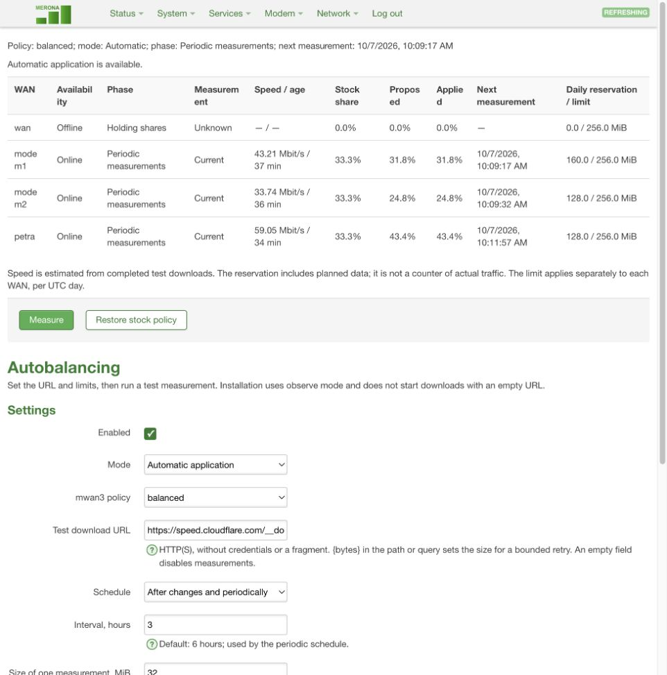
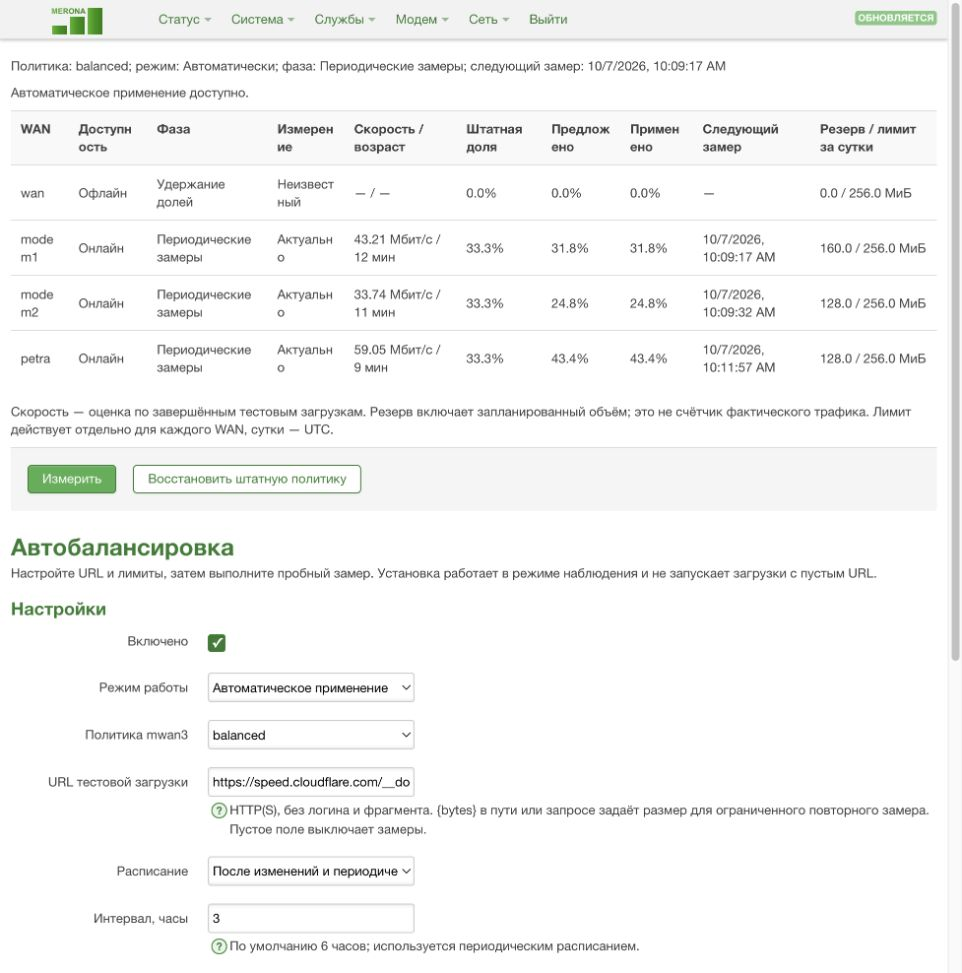
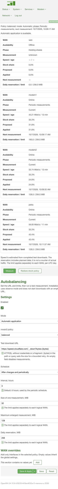

# mwan3-autobalancer

An adaptive N-WAN policy controller for OpenWrt/mwan3, with a minimal authenticated LuCI interface.

## Screenshots

Actual LuCI captures from router validation. The displayed speeds and shares are example measurements. English and Russian follow the normal LuCI language preference.

Russian interface

Mobile interface

## Project status

The controller and LuCI interface are implemented. Router validation has covered bounded measurements, controlled runtime changes, independent crash recovery and startup failure. See the [device validation report](docs/DEVICE-VALIDATION.ru.md) for evidence and limits. This is an experimental controller; installation starts in observation mode. No source code from KIT BusRouter has been copied into this repository.

The tested integration target is OpenWrt 24.10.8, mwan3 2.11.16 and the IPv4 iptables-legacy backend on an ARM64 router. Support for additional versions and firewall backends requires separate verification.

## Behavior

- Discover any supported number of WAN members from a selected mwan3 policy.
- Measure per-WAN throughput with explicit time, payload and persistent budget limits.
- Smooth valid measurements and calculate proportional weights, retaining configured priorities and safe behavior when measurements are missing or stale.
- Update only the selected runtime policy without restarting mwan3 or flushing conntrack.
- Provide one LuCI page for WAN status, measured speeds, proposed/applied shares, probe budgets and essential settings.
- Start in observation mode, with automatic policy changes disabled until the adapter and integration tests pass.

This is connection-based load balancing. It does not combine several WANs within one TCP stream.

## Documents

- [Design](docs/specs/2026-10-06-design.md)
- [Python versus Go comparison](docs/research/2026-10-06-python-vs-go.md)
- [Emergency recovery and removal commands](docs/RECOVERY.ru.md)
- [Calibration, maintenance and probe budgets (Russian)](docs/SCHEDULING.ru.md)
- [Router validation and its limits (Russian)](docs/DEVICE-VALIDATION.ru.md)
- [v0.1.2 retry fix and router upgrade validation (Russian)](docs/DEVICE-VALIDATION-0.1.2.ru.md)
- [v0.1.3 watchdog readiness and LuCI validation (Russian)](docs/DEVICE-VALIDATION-0.1.3.ru.md)

The implementation language is Go with a pure-Go release profile. LuCI remains a small authenticated JS frontend, without a separate public web server. The initial schedule uses a finite calibration phase followed by six-hour maintenance probes; an optional on-change mode stops periodic active probes after calibration while keeping supervision running.

The LuCI page supports English and Russian using the normal LuCI language preference. English is the source language; the Russian catalog is included in the UI package. Changing the display language does not alter WAN settings or the controller mode.

The module supports Go 1.23 and later. CI checks the SDK's Go 1.23.12 baseline alongside Go 1.27.1; the router needs neither a compiler nor a Python runtime.

Automatic applying fails closed when the independent recovery watchdog is unavailable. The controller does not flash firmware, change bootloader/LAN/Wi-Fi settings, or persist measured weights to the base mwan3 configuration. Controlled device tests verified refusal without watchdog readiness and restoration after a controller crash; this is not a guarantee against arbitrary defects in a root process.

If configuration or WAN generation changes before an update is armed, the controller leaves the rules unchanged and tries again on the next normal cycle using a fresh snapshot. Policy conflicts, unavailable recovery and uncertain writes remain blocked until verified recovery; a safe refusal does not permanently disable automatic updates. Controller 0.1.2-r1 also retires the two legacy generation-change blockers while preserving measurements, schedules, budgets and settings. The LuCI package remains 0.1.1-r1.

## Reference project

[KIT BusRouter](https://git.keylinkit.net/allen/kit-busrouter) was studied as an example of a measure/smooth/decide/apply control loop. No redistribution license was located in its repository root or the examined WAN-controller package. This project will contain independently written code and will not include upstream fleet configurations, credentials or deployment assets.

## License

MIT for this project's own files. See [LICENSE](LICENSE).
